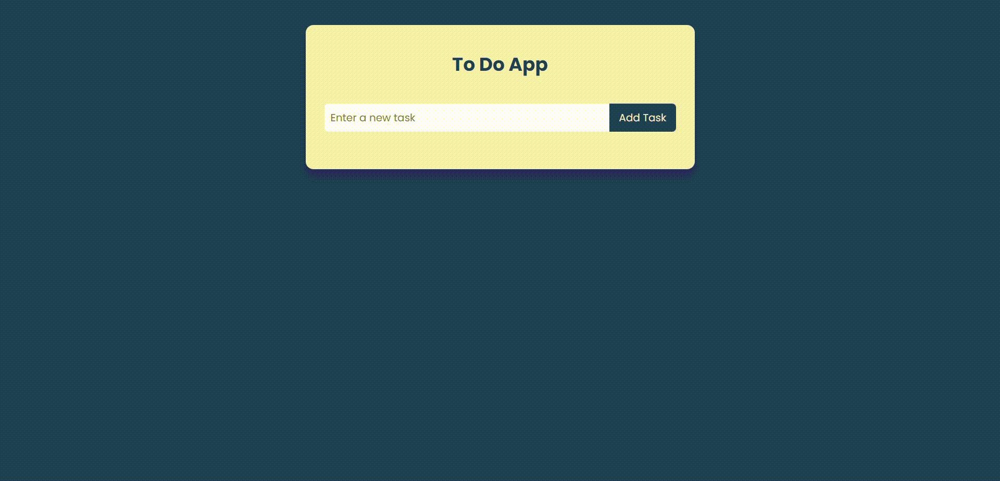

# To Do App

## About

A To-Do App which preforms basic CRUD operations, created using ReactJS.

## Languages

React, CSS

## Features

User can Add a task, Update a Task and Delete a Task. The tasks are stored in Local Storage so the user can retreive them even after reload.

## Challenges

Using Array methods to perform edit and delete operations. Also, creating alerts with the help of useEffect hook and setTimeout function.
